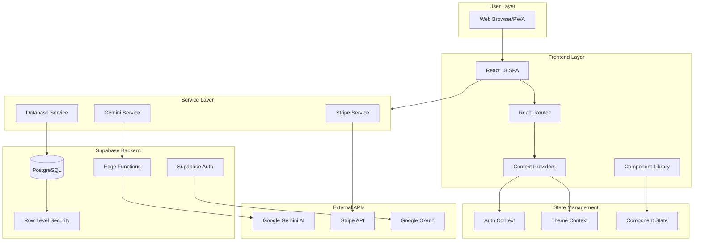
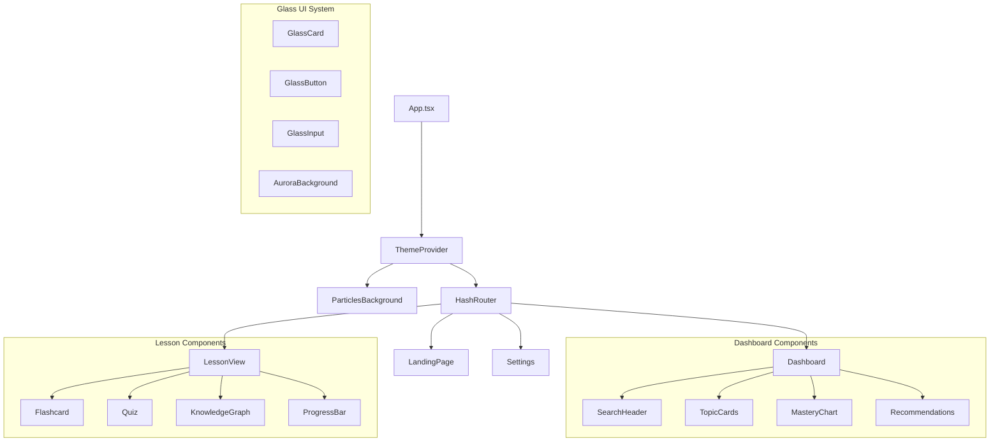
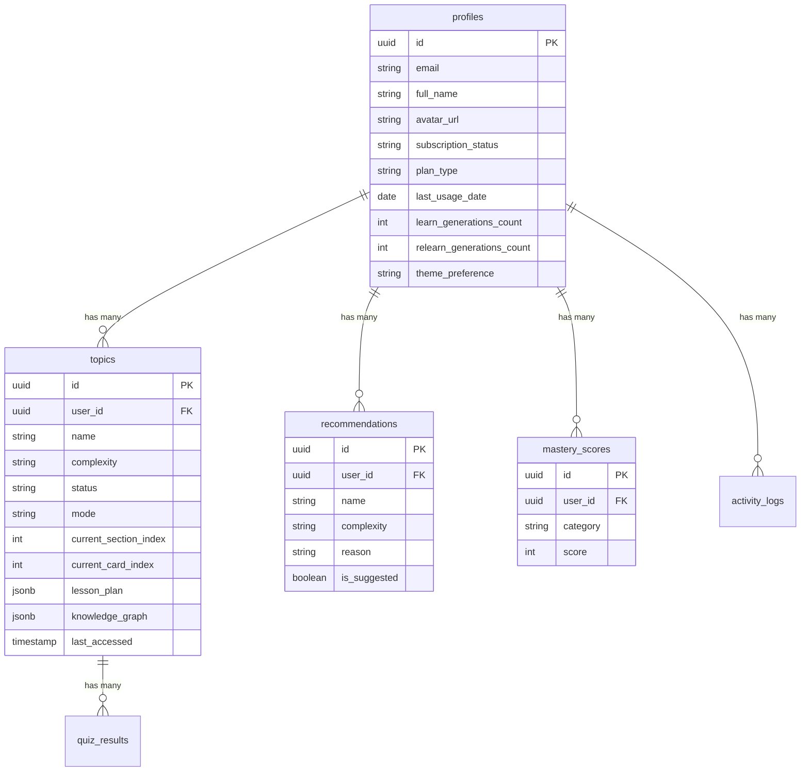
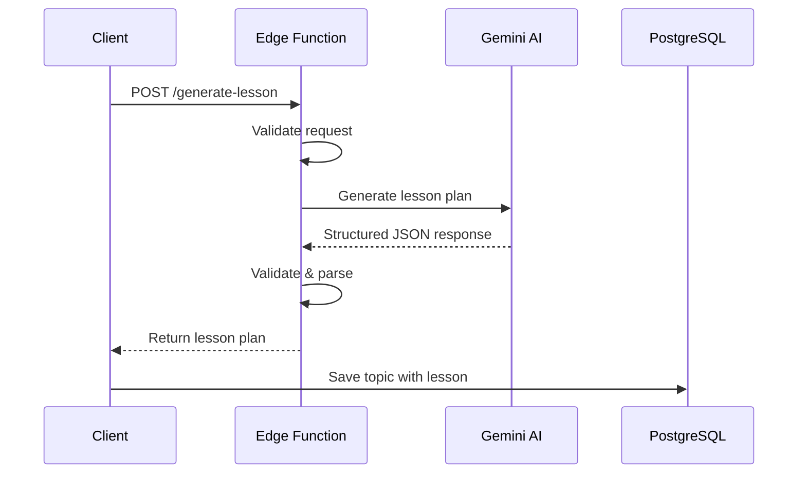
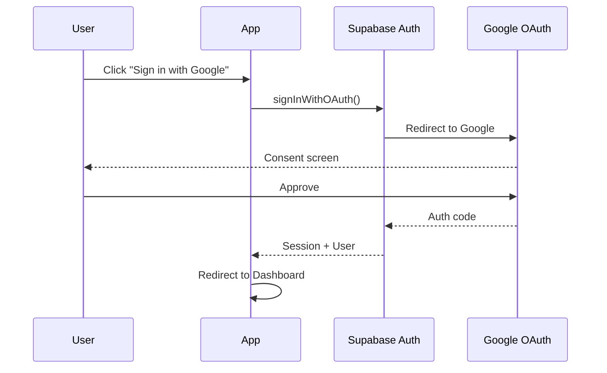
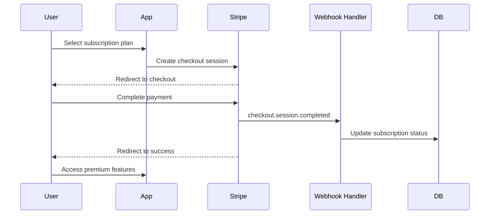

# System Architecture

Detailed technical documentation of Relearnable's architecture, design patterns, and system integrations.

---

## High-Level Architecture



---

## Frontend Architecture

### Component Hierarchy



### Design System

The application uses a custom **Glassmorphic Design System** with:

| Token | Light Mode | Dark Mode |
|-------|-----------|-----------|
| `glass-100` | `rgba(255,255,255,0.7)` | `rgba(30,30,35,0.6)` |
| `glass-200` | `rgba(255,255,255,0.8)` | `rgba(40,40,45,0.7)` |
| `glass-border` | `rgba(0,0,0,0.1)` | `rgba(255,255,255,0.1)` |
| `neon-blue` | `#2563eb` | `#00f3ff` |
| `neon-purple` | `#7c3aed` | `#a855f7` |

---

## Backend Architecture

### Database Schema



### Row Level Security (RLS)

All tables implement RLS policies ensuring users can only access their own data:

```sql
-- Example policy pattern
CREATE POLICY "Users can only view own topics"
ON topics FOR SELECT
USING (auth.uid() = user_id);

CREATE POLICY "Users can only insert own topics"
ON topics FOR INSERT
WITH CHECK (auth.uid() = user_id);
```

---

## AI Integration Architecture

### Edge Function Flow



### AI Actions

| Action | Description | Output |
|--------|-------------|--------|
| `generateLessonPlan` | Full lesson with sections, flashcards, quizzes | `LessonPlan` |
| `generatePlacementTest` | Diagnostic quiz + initial knowledge graph | `PlacementResult` |
| `expandCurriculum` | Add new nodes to knowledge graph | `KnowledgeGraph` |
| `generateRelearnPlan` | Targeted remediation content | `LessonPlan` |
| `generateRecommendations` | Next topic suggestions | `Recommendation[]` |

---

## Authentication Flow



---

## Payment Integration



---

## Performance Optimizations

### Implemented Strategies

1. **Code Splitting**: React.lazy for route-level components
2. **Optimistic Updates**: Immediate UI feedback before DB confirmation
3. **Debounced Search**: Prevent excessive API calls during typing
4. **Animation Performance**: `will-change` hints, GPU-accelerated transforms
5. **Image Optimization**: SVG icons, lazy loading for large assets
6. **Bundle Optimization**: Vite tree-shaking, chunk splitting

### Lighthouse Scores

| Metric | Score |
|--------|-------|
| Performance | 90+ |
| Accessibility | 95+ |
| Best Practices | 100 |
| SEO | 90+ |

---

## Security Considerations

- **API Keys**: Never exposed to client; AI calls routed through Edge Functions
- **Authentication**: Supabase Auth with Google OAuth
- **Authorization**: Row Level Security on all database tables
- **HTTPS**: Enforced on all connections
- **Input Validation**: Server-side validation in Edge Functions
- **Payment Security**: Stripe handles all payment data (PCI compliant)
