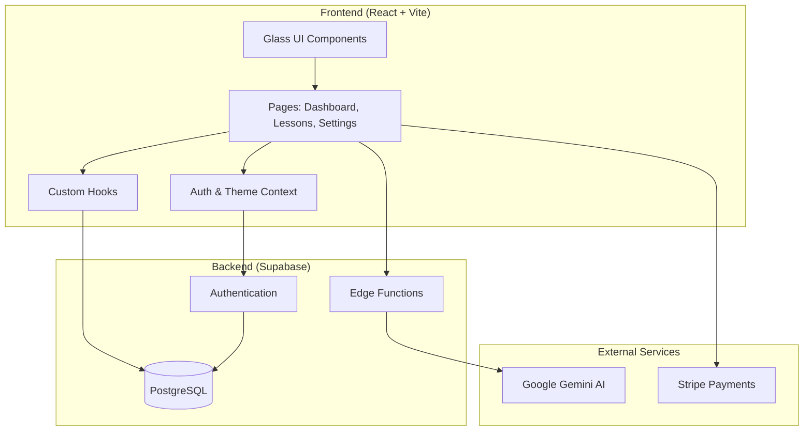

<div align="center">

# 🧠 Relearnable

### AI-Powered Adaptive Learning Platform

🚀 **Live Production SaaS** — *Master any topic with personalized flashcards, quizzes, and intelligent curriculum trees*

[](https://react.dev/)
[](https://www.typescriptlang.org/)
[](https://supabase.com/)
[](https://ai.google.dev/)
[](https://stripe.com/)
[](https://www.framer.com/motion/)

---

**[🌐 Live Demo](https://relearnable.ai)** · **[💼 LinkedIn](https://linkedin.com/in/sahilkamalny)** · **[🌍 Portfolio](https://sahilkamal.dev)** · **[📧 Contact](mailto:sahilkamal.dev@gmail.com)**

</div>

---

## 📸 Screenshots

<div align="center">

| Landing Page | Dashboard |
|:---:|:---:|
|  | .png) |

| Flashcard Lessons | Interactive Quizzes |
|:---:|:---:|
|  |  |

| Curriculum Tree | Mastery Tracking |
|:---:|:---:|
|  | .png) |

</div>

---

## ✨ Features

### 🎯 Adaptive Learning Engine
- **Learn Mode**: Generate comprehensive lessons on any topic with AI-crafted flashcards and quizzes
- **Relearn Mode**: Placement tests identify knowledge gaps, creating targeted remediation curricula
- **Difficulty Levels**: Beginner, Intermediate, and Advanced content tailored to your skill level

### 🌳 Knowledge Graph Visualization
- Interactive node-based curriculum tree
- Visual progress tracking with locked/unlocked/completed states
- Pan, zoom, and touch-enabled navigation
- Dynamic curriculum expansion as you master topics

### 📊 Mastery Tracking System
- Radar chart visualization across 15 knowledge categories
- Animated hover interactions with smooth transitions
- Category-specific scoring and progress persistence
- Real-time updates as you complete lessons

### 🤖 AI-Powered Content Generation
- Google Gemini API integration via Supabase Edge Functions
- Structured lesson plans with sections, flashcards, and quizzes
- Intelligent recommendations based on completed topics
- Dynamic placement test generation for relearn pathways

### 💎 Premium UI/UX
- Custom glassmorphic design system
- Aurora backgrounds with animated particles
- Framer Motion micro-animations throughout
- Full dark/light mode support with system preference detection
- PWA support for mobile installation

### 💳 Subscription Management
- Stripe integration for recurring payments
- Free tier with usage limits
- Monthly and yearly premium plans
- Secure webhook-based subscription status sync

---

## 🏗️ Architecture Overview



### Key Architectural Decisions

| Component | Choice | Rationale |
|-----------|--------|-----------|
| **Frontend** | React 18 + TypeScript | Type safety, modern hooks, excellent ecosystem |
| **Build Tool** | Vite | Lightning-fast HMR, optimized production builds |
| **Styling** | Tailwind CSS + Custom Design Tokens | Rapid development with consistent design system |
| **Animations** | Framer Motion | Declarative animations, gesture support, layout animations |
| **Backend** | Supabase | Real-time subscriptions, built-in auth, edge functions |
| **AI** | Google Gemini via Edge Functions | Server-side API key protection, structured JSON output |
| **Payments** | Stripe | Industry-standard, webhook reliability, subscription management |
| **Charts** | Recharts | React-native charting, responsive, customizable |

---

## 📁 Project Structure

```
relearnable/
├── src/
│   ├── components/ui/       # Glassmorphic design system
│   └── assets/              # SVG icons and images
├── components/              # Feature components
│   ├── KnowledgeGraph.tsx   # Interactive curriculum tree
│   ├── MasteryChart.tsx     # Radar chart visualization
│   ├── Quiz.tsx             # Quiz engine with explanations
│   └── Flashcard.tsx        # Animated flashcards
├── pages/                   # Route components
│   ├── Dashboard.tsx        # Main learning hub
│   ├── LessonView.tsx       # Flashcard & quiz flow
│   ├── Settings.tsx         # Account management
│   └── LandingPage.tsx      # Marketing & auth
├── services/                # API integrations
│   ├── databaseService.ts   # Supabase CRUD operations
│   ├── geminiService.ts     # AI content generation
│   └── stripeService.ts     # Payment handling
├── contexts/                # Global state
│   ├── AuthContext.tsx      # Authentication state
│   └── ThemeContext.tsx     # Dark/light mode
├── hooks/                   # Custom React hooks
├── supabase/functions/      # Edge functions for AI
└── types.ts                 # TypeScript definitions
```

---

## 🧩 Code Samples

This repository includes representative code samples demonstrating various technical skills:

### TypeScript Type Definitions
Well-structured interfaces for learning entities with proper typing and documentation.

→ [View Types](code-samples/types/models.ts)

### Custom React Hooks
PWA install prompt handling with browser API integration.

→ [View Hook](code-samples/hooks/useInstallPrompt.ts)

### Glass UI Components
Reusable glassmorphic button with Framer Motion animations and dark mode support.

→ [View Component](code-samples/components/GlassButton.tsx)

### Loading Animations
Animated thinking indicator using Framer Motion.

→ [View Component](code-samples/components/ThinkingPills.tsx)

---

## 🛠️ Technical Highlights

- **15+ Custom Components** built with accessibility in mind
- **20+ Database Operations** with optimistic updates
- **5 AI Endpoints** for dynamic content generation
- **Real-time Sync** for progress across devices
- **Responsive Design** from mobile to desktop
- **PWA Ready** with offline support considerations

---

## 📊 Tech Stack Deep Dive

| Layer | Technologies |
|-------|-------------|
| **Core** | React 18, TypeScript 5.3, Vite 5 |
| **Styling** | Tailwind CSS 4, Custom CSS Variables |
| **Animation** | Framer Motion 11, CSS Animations |
| **State** | React Context, Custom Hooks |
| **Routing** | React Router 6 |
| **Backend** | Supabase (Auth, Database, Edge Functions) |
| **AI** | Google Gemini API (gemini-2.0-flash) |
| **Payments** | Stripe (Checkout, Webhooks, Portal) |
| **Charts** | Recharts (Radar, Responsive) |
| **Effects** | tsparticles, canvas-confetti |

---

## 📬 Contact

**Sahil Kamal** - Full-Stack Developer

- 🌐 Portfolio: [sahilkamal.dev](https://sahilkamal.dev)
- 💼 LinkedIn: [linkedin.com/in/sahilkamalny](https://linkedin.com/in/sahilkamalny)
- 📧 Email: [sahilkamal.dev@gmail.com](mailto:sahilkamal.dev@gmail.com)

---

<div align="center">

### 🔒 Note on Source Code

This repository contains documentation and representative code samples for portfolio purposes.
The full source code is proprietary and not available for redistribution.

**© 2025 Sahil Kamal. All Rights Reserved.**

</div>
